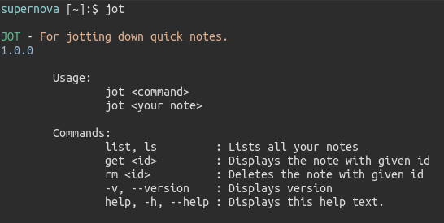

# jot

For jotting down quick notes.

# Installation

Currently there is no packaging. You need `node.js` at any version at or above `15.0.1`

I recommend getting nvm (https://github.com/nvm-sh/nvm) and installing correct version with:

`nvm install 15.0.1`

Once you sort out the dependencies run `./install.sh` script, follow instructions.

# Dependencies

- npm
- chalk
- lowdb

`npm install --save [library]` to install once you have installed npm.

# Usage

Type `jot help` to see the help message.

```
JOT - For jotting down quick notes.
1.0.0

        Usage:
                jot <command>
                jot <your note>

        Commands:
                list, ls         : Lists all your notes
                get <id>         : Displays the note with given id
                rm <id>          : Deletes the note with given id
                -v, --version    : Displays version
                help, -h, --help : Displays this help text.
```




